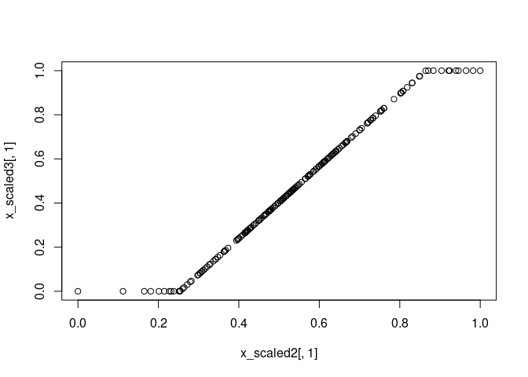

dynutils
========

Provides common functionality for the 'dynverse' packages. The functions
in dynutils are showcased below, in no particular order.

'dynverse' is created to support the development, execution, and
benchmarking of trajectory inference methods. For more information,
check out
[github.com/dynverse/dynverse](https://github.com/dynverse/dynverse).

Manipulation of lists
---------------------

### `add_class`: Add a class to an object

    l <- list(important_number = 42) %>% add_class("my_list")
    l

    ## $important_number
    ## [1] 42
    ## 
    ## attr(,"class")
    ## [1] "my_list" "list"

### `extend_with`: Extend list with more data

    l %>% extend_with(
      .class_name = "improved_list", 
      url = "https://github.com/dynverse/dynverse"
    )

    ## $important_number
    ## [1] 42
    ## 
    ## $url
    ## [1] "https://github.com/dynverse/dynverse"
    ## 
    ## attr(,"class")
    ## [1] "improved_list" "my_list"       "list"

Distances
---------

### `calculate_distance`: Compute pairwise distances between two matrices

See `?calculate_distance` for the list of currently supported distances.

    x <- matrix(runif(30), ncol = 10)
    y <- matrix(runif(50), ncol = 10)
    calculate_distance(x, y, method = "euclidean")

    ##          [,1]      [,2]      [,3]     [,4]      [,5]
    ## [1,] 1.184305 0.9571034 1.1284052 1.022205 1.5531565
    ## [2,] 1.078353 1.1378581 0.7076092 1.072164 0.8846294
    ## [3,] 1.335627 1.4116406 1.3526085 1.239853 1.6282805

For euclidean distances, this is similar to calculating:

    as.matrix(dist(rbind(x, y)))[1:3, -1:-3]

    ##          4         5         6        7         8
    ## 1 1.184305 0.9571034 1.1284052 1.022205 1.5531565
    ## 2 1.078353 1.1378581 0.7076092 1.072164 0.8846294
    ## 3 1.335627 1.4116406 1.3526085 1.239853 1.6282805

Manipulation of matrices
------------------------

### `expand_matrix`: Add rows and columns to a matrix

    x <- matrix(runif(12), ncol = 4, dimnames = list(c("a", "c", "d"), c("D", "F", "H", "I")))
    expand_matrix(x, letters[1:5], LETTERS[1:10], fill = 0)

    ##   A B C         D E         F G         H          I J
    ## a 0 0 0 0.4346595 0 0.3253522 0 0.7111212 0.14330438 0
    ## b 0 0 0 0.0000000 0 0.0000000 0 0.0000000 0.00000000 0
    ## c 0 0 0 0.7125147 0 0.7570871 0 0.1216919 0.23962942 0
    ## d 0 0 0 0.3999944 0 0.2026923 0 0.2454885 0.05893438 0
    ## e 0 0 0 0.0000000 0 0.0000000 0 0.0000000 0.00000000 0

Scaling of matrices and vectors
-------------------------------

### `scale_uniform`: Rescale data to have a certain center and max range

Generate a matrix from a normal distribution with a large standard
deviation, centered at c(5, 5).

    x <- matrix(rnorm(200*2, sd = 10, mean = 5), ncol = 2)

Center the dataset at c(0, 0) with a minimum of c(-.5, -.5) and a
maximum of c(.5, .5).

    x_scaled <- scale_uniform(x, center = 0, max_range = 1)

Check the ranges and verify that the scaling is correct.

    ranges <- apply(x_scaled, 2, range)
    ranges                   # should all lie between -.5 and .5

    ##            [,1] [,2]
    ## [1,] -0.4760807 -0.5
    ## [2,]  0.4760807  0.5

    colMeans(ranges)         # should all be equal to 0

    ## [1] 0 0

    apply(ranges, 2, diff)   # max should be 1

    ## [1] 0.9521614 1.0000000

### `scale_minmax`: Rescale data to a \[0, 1\] range

    x_scaled2 <- scale_minmax(x)

Check the ranges and verify that the scaling is correct.

    apply(x_scaled2, 2, range)  # each column should be [0, 1]

    ##      [,1] [,2]
    ## [1,]    0    0
    ## [2,]    1    1

### `scale_quantile`: Cut off outer quantiles and rescale to a \[0, 1\] range

    x_scaled3 <- scale_quantile(x, .05)

Check the ranges and verify that the scaling is correct.

    apply(x_scaled3, 2, range)   # each column should be [0, 1]

    ##      [,1] [,2]
    ## [1,]    0    0
    ## [2,]    1    1

    plot(x_scaled2[,1], x_scaled3[,1])

Manipulation of functions
-------------------------

### `inherit_default_params`: Have one function inherit the default parameters from other functions

    fun1 <- function(a = 10, b = 7) runif(a, -b, b)
    fun2 <- function(c = 9) 2^c

    fun3 <- inherit_default_params(
      super = list(fun1, fun2),
      fun = function(a, b, c) {
        list(x = fun1(a, b), y = fun2(c))
      }
    )

    fun3

    ## function (a = 10, b = 7, c = 9) 
    ## {
    ##     list(x = fun1(a, b), y = fun2(c))
    ## }

Manipulation of packages
------------------------

### `check_packages`: Easily checking whether certain packages are installed

    check_packages("SCORPIUS", "dynutils", "wubbalubbadubdub")

    ##         SCORPIUS         dynutils wubbalubbadubdub 
    ##             TRUE             TRUE            FALSE

    check_packages(c("princurve", "mlr", "tidyverse"))

    ## princurve       mlr tidyverse 
    ##      TRUE     FALSE      TRUE

### `install_packages`: Install packages taking into account the remotes of another

This is useful for installing suggested packages with GitHub remotes.

    install_packages("SCORPIUS", package = "dynmethods", prompt = TRUE)

    > install_packages("SCORPIUS", package = "dynmethods", prompt = TRUE)
    Following packages have to be installed: SCORPIUS
    Do you want to install these packages? (y/yes/1 or n/no/2): 1
    Installing SCORPIUS
    ...
    ** testing if installed package can be loaded
    * DONE (SCORPIUS)
    Installed SCORPIUS
    [1] "SCORPIUS"

Manipulation of character vectors
---------------------------------

### `pritt`: A friendly version of `glue::glue`

    a <- 10
    pritt("a: {a}")

    ## [1] "a: 10"

    comparison <- glue::glue("a: {a}")
    comparison            # glue::glue prints differently than base R

    ## a: 10

    class(comparison)     # glue::glue adds a class to the output

    ## [1] "glue"      "character"

### `random_time_string`: Generates a string very likely to be unique

    random_time_string("test")

    ## [1] "20180705_090432__test__FAUHkCAKzv"

    random_time_string("test")

    ## [1] "20180705_090432__test__QLNDDJECgw"

    random_time_string("test")

    ## [1] "20180705_090432__test__rEBbJsr2U8"
