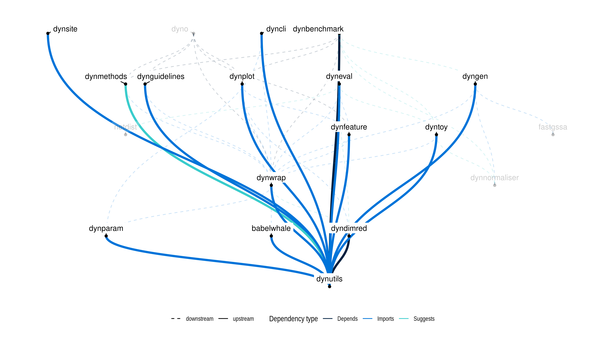

# dynutils

Provides common functionality for the dynverse packages. An overview of
this functionality is available using the `?dynutils` command or in the
[examples
vignette](https://CRAN.R-project.org/package=dynutils/vignettes/functionality.html).

dynverse is created to support the development, execution, and
benchmarking of trajectory inference methods. For more information,
check out [dynverse.org](https://dynverse.org).

## Latest changes

Check out `news(package = "dynutils")` or [NEWS.md](NEWS.md) for a full
list of changes.

<!-- This section gets automatically generated from inst/NEWS.md, and also generates inst/NEWS -->

### Recent changes in dynutils 1.0.6

-   MINOR CHANGE `calculate_distance()`: Allow for many more distance
    measures.

### Recent changes in dynutils 1.0.5 (2020-02-21)

-   BUG FIX `install_packages()`: will not try to install packages when
    the session is not interactive.

-   LICENSE: Change to MIT.

## Dynverse dependencies

<!-- Generated by "update_dependency_graphs.R" in the main dynverse repo -->

