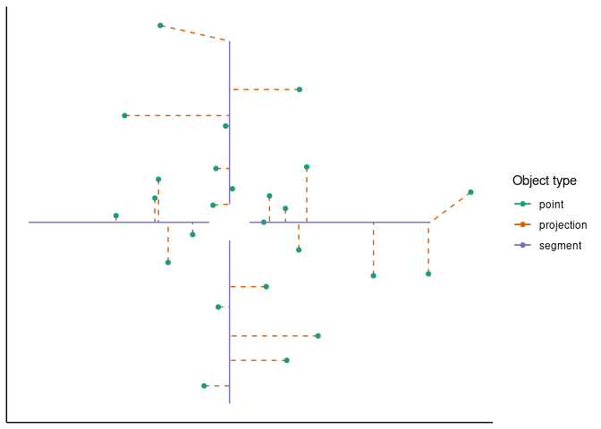
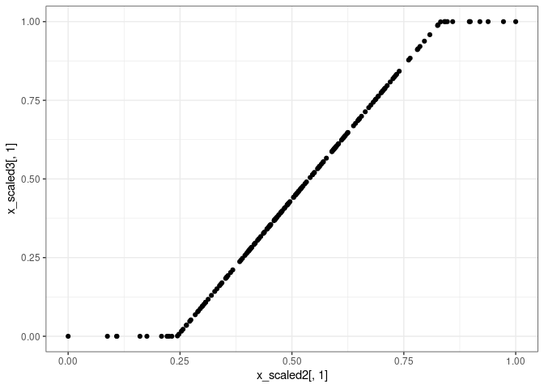

Overview of the functionality provided by the dynutils package
================
Robrecht Cannoodt & Wouter Saelens

<!-- github markdown using
rmarkdown::render("vignettes/functionality.Rmd", output_format = "github_document")
-->

## Table of contents

  - Manipulation of lists:
    [`add_class`](functionality.md#add_class-add-a-class-to-an-object),
    [`extend_with`](functionality.md#extend_with-extend-list-with-more-data)
  - Calculations:
    [`calculate_distance`](functionality.md#calculate_distance-compute-pairwise-distances-between-two-matrices),
    [`project_to_segments`](functionality.md#project_to_segments-project-a-set-of-points-to-to-set-of-segments),
    [`calculate_mean`](functionality.md#calculate_mean-calculate-a-weighted-mean-between-vectors-or-a-list-of-vectors-supports-the-arithmetic-geometric-and-harmonic-mean)
  - Manipulation of matrices:
    [`expand_matrix`](functionality.md#expand_matrix-add-rows-and-columns-to-a-matrix)
  - Scaling of matrices and vectors:
    [`scale_uniform`](functionality.md#scale_uniform-rescale-data-to-have-a-certain-center-and-max-range),
    [`scale_minmax`](functionality.md#scale_minmax-rescale-data-to-a---range),
    [`scale_quantile`](functionality.md#scale_quantile-cut-off-outer-quantiles-and-rescale-to-a---range)
  - Manipulation of functions:
    [`inherit_default_params`](functionality.md#inherit_default_params-have-one-function-inherit-the-default-parameters-from-other-functions)
  - Manipulation of packages:
    [`check_packages`](functionality.md#check_packages-easily-checking-whether-certain-packages-are-installed),
    [`install_packages`](functionality.md#install_packages-install-packages-taking-into-account-the-remotes-of-another)
  - Manipulation of vectors:
    [`random_time_string`](functionality.md#random_time_string-generates-a-string-very-likely-to-be-unique)
  - Tibble helpers:
    [`list_as_tibble`](functionality.md#list_as_tibble-convert-a-list-of-lists-to-a-tibble-whilst-retaining-class-information),
    [`tibble_as_list`](functionality.md#tibble_as_list-convert-a-tibble-back-to-a-list-of-lists-whilst-retaining-class-information),
    [`extract_row_to_list`](functionality.md#extract_row_to_list-extracts-one-row-from-a-tibble-and-converts-it-to-a-list),
    [`mapdf`](functionality.md#mapdf-apply-a-function-to-each-row-of-a-data-frame)
  - File helpers:
    [`safe_tempdir`](functionality.md#safe_tempdir-create-an-empty-temporary-directory-and-return-its-path)
  - Assertion helpers:
    [`%all_in%`](functionality.md#all_in-check-whether-a-vector-are-all-elements-of-another-vector),
    [`%has_names%`](functionality.md#has_names-check-whether-an-object-has-certain-names),
    [`is_single_numeric`](functionality.md#is_single_numeric-check-whether-a-value-is-a-single-numeric),
    [`is_bounded`](functionality.md#is_bounded-check-whether-a-value-within-a-certain-interval)

## Manipulation of lists

### `add_class`: Add a class to an object

``` r
l <- list(important_number = 42) %>% add_class("my_list")
l
#> $important_number
#> [1] 42
#> 
#> attr(,"class")
#> [1] "my_list" "list"
```

### `extend_with`: Extend list with more data

``` r
l %>% extend_with(
  .class_name = "improved_list", 
  url = "https://github.com/dynverse/dynverse"
)
#> $important_number
#> [1] 42
#> 
#> $url
#> [1] "https://github.com/dynverse/dynverse"
#> 
#> attr(,"class")
#> [1] "improved_list" "my_list"       "list"
```

## Calculations

### `calculate_distance`: Compute pairwise distances between two matrices

See `?calculate_distance` for the list of currently supported distances.

``` r
x <- matrix(runif(30), ncol = 10)
y <- matrix(runif(50), ncol = 10)
calculate_distance(x, y, method = "euclidean")
#>          [,1]      [,2]      [,3]     [,4]      [,5]
#> [1,] 1.184305 0.9571034 1.1284052 1.022205 1.5531565
#> [2,] 1.078353 1.1378581 0.7076092 1.072164 0.8846294
#> [3,] 1.335627 1.4116406 1.3526085 1.239853 1.6282805
```

For euclidean distances, this is similar to calculating:

``` r
as.matrix(dist(rbind(x, y)))[1:3, -1:-3]
#>          4         5         6        7         8
#> 1 1.184305 0.9571034 1.1284052 1.022205 1.5531565
#> 2 1.078353 1.1378581 0.7076092 1.072164 0.8846294
#> 3 1.335627 1.4116406 1.3526085 1.239853 1.6282805
```

### `project_to_segments`: Project a set of points to to set of segments

``` r
x <- matrix(rnorm(50, 0, .5), ncol = 2)
segfrom <- matrix(c(0, 1, 0, -1, 1, 0, -1, 0), ncol = 2, byrow = TRUE)
segto <- segfrom / 10
fit <- project_to_segments(x, segfrom, segto)

ggplot() +
  geom_segment(aes(x = x[,1], xend = fit$x_proj[,1], y = x[,2], yend = fit$x_proj[,2], colour = "projection"), linetype = "dashed") +
  geom_point(aes(x[,1], x[,2], colour = "point")) +
  geom_segment(aes(x = segfrom[,1], xend = segto[,1], y = segfrom[,2], yend = segto[,2], colour = "segment")) +
  scale_colour_brewer(palette = "Dark2") +
  scale_x_continuous(name = NULL, breaks = NULL) +
  scale_y_continuous(name = NULL, breaks = NULL) +
  labs(colour = "Object type") +
  theme_classic()
```

<!-- -->

``` r

str(fit)
#> List of 4
#>  $ x_proj     : num [1:25, 1:2] 0 0 0 0.278 0 ...
#>  $ distance   : num [1:25] 0.0068 0.01605 0.12144 0.00587 0.12604 ...
#>  $ segment    : int [1:25] 1 2 1 3 1 4 2 3 2 2 ...
#>  $ progression: num [1:25] 1 0.108 0.297 0.802 0 ...
```

### `calculate_mean`: Calculate a (weighted) mean between vectors or a list of vectors; supports the arithmetic, geometric and harmonic mean

``` r
calculate_arithmetic_mean(0.1, 0.5, 0.9)
#> [1] 0.5
calculate_geometric_mean(0.1, 0.5, 0.9)
#> [1] 0.3556893
calculate_harmonic_mean(0.1, 0.5, 0.9)
#> [1] 0.2288136
calculate_mean(.1, .5, .9, method = "harmonic")
#> [1] 0.2288136

# example with multiple vectors
calculate_arithmetic_mean(c(0.1, 0.9), c(0.2, 1))
#> [1] 0.15 0.95

# example with a list of vectors
vectors <- list(c(0.1, 0.2), c(0.4, 0.5))
calculate_geometric_mean(vectors)
#> [1] 0.2000000 0.3162278

# example of weighted means
calculate_geometric_mean(c(0.1, 10), c(0.9, 20), c(0.5, 2), weights = c(1, 2, 5))
#> [1] 0.4736057 4.3491186
```

## Manipulation of matrices

### `expand_matrix`: Add rows and columns to a matrix

``` r
x <- matrix(runif(12), ncol = 4, dimnames = list(c("a", "c", "d"), c("D", "F", "H", "I")))
expand_matrix(x, letters[1:5], LETTERS[1:10], fill = 0)
#>   A B C         D E         F G         H         I J
#> a 0 0 0 0.2937302 0 0.5033395 0 0.7581031 0.5476466 0
#> b 0 0 0 0.0000000 0 0.0000000 0 0.0000000 0.0000000 0
#> c 0 0 0 0.1912601 0 0.8770575 0 0.7244989 0.7117439 0
#> d 0 0 0 0.8864509 0 0.1891936 0 0.9437248 0.3889051 0
#> e 0 0 0 0.0000000 0 0.0000000 0 0.0000000 0.0000000 0
```

## Scaling of matrices and vectors

### `scale_uniform`: Rescale data to have a certain center and max range

Generate a matrix from a normal distribution with a large standard
deviation, centered at c(5, 5).

``` r
x <- matrix(rnorm(200*2, sd = 10, mean = 5), ncol = 2)
```

Center the dataset at c(0, 0) with a minimum of c(-.5, -.5) and a
maximum of c(.5, .5).

``` r
x_scaled <- scale_uniform(x, center = 0, max_range = 1)
```

Check the ranges and verify that the scaling is correct.

``` r
ranges <- apply(x_scaled, 2, range)
ranges                   # should all lie between -.5 and .5
#>            [,1] [,2]
#> [1,] -0.4061179 -0.5
#> [2,]  0.4061179  0.5
colMeans(ranges)         # should all be equal to 0
#> [1] 0 0
apply(ranges, 2, diff)   # max should be 1
#> [1] 0.8122358 1.0000000
```

### `scale_minmax`: Rescale data to a \[0, 1\] range

``` r
x_scaled2 <- scale_minmax(x)
```

Check the ranges and verify that the scaling is correct.

``` r
apply(x_scaled2, 2, range)  # each column should be [0, 1]
#>      [,1] [,2]
#> [1,]    0    0
#> [2,]    1    1
```

### `scale_quantile`: Cut off outer quantiles and rescale to a \[0, 1\] range

``` r
x_scaled3 <- scale_quantile(x, .05)
```

Check the ranges and verify that the scaling is correct.

``` r
apply(x_scaled3, 2, range)   # each column should be [0, 1]
#>      [,1] [,2]
#> [1,]    0    0
#> [2,]    1    1
qplot(x_scaled2[,1], x_scaled3[,1]) + theme_bw()
```

<!-- -->

## Manipulation of functions

### `inherit_default_params`: Have one function inherit the default parameters from other functions

``` r
fun1 <- function(a = 10, b = 7) runif(a, -b, b)
fun2 <- function(c = 9) 2^c

fun3 <- inherit_default_params(
  super = list(fun1, fun2),
  fun = function(a, b, c) {
    list(x = fun1(a, b), y = fun2(c))
  }
)

fun3
#> function (a = 10, b = 7, c = 9) 
#> {
#>     list(x = fun1(a, b), y = fun2(c))
#> }
```

## Manipulation of packages

### `check_packages`: Easily checking whether certain packages are installed

``` r
check_packages("SCORPIUS", "dynutils", "wubbalubbadubdub")
#>         SCORPIUS         dynutils wubbalubbadubdub 
#>             TRUE             TRUE            FALSE
check_packages(c("princurve", "mlr", "tidyverse"))
#> princurve       mlr tidyverse 
#>      TRUE      TRUE      TRUE
```

### `install_packages`: Install packages taking into account the remotes of another

This is useful for installing suggested packages with GitHub
    remotes.

``` r
install_packages("SCORPIUS", package = "dynmethods", prompt = TRUE)
```

    > install_packages("SCORPIUS", package = "dynmethods", prompt = TRUE)
    Following packages have to be installed: SCORPIUS
    Do you want to install these packages? (y/yes/1 or n/no/2): 1
    Installing SCORPIUS
    ...
    ** testing if installed package can be loaded
    * DONE (SCORPIUS)
    Installed SCORPIUS
    [1] "SCORPIUS"

## Manipulation of vectors

### `random_time_string`: Generates a string very likely to be unique

``` r
random_time_string("test")
#> [1] "20190705_115004__test__syYeN626jT"

random_time_string("test")
#> [1] "20190705_115004__test__e6MCnXcJM7"

random_time_string("test")
#> [1] "20190705_115004__test__9pFJ5mxS3R"
```

## Tibble helpers

### `list_as_tibble`: Convert a list of lists to a tibble whilst retaining class information

``` r
li <- list(
  list(a = 1, b = log10, c = "parrot") %>% add_class("myobject"), 
  list(a = 2, b = sqrt, c = "quest") %>% add_class("yourobject")
)

tib <- list_as_tibble(li)

tib
#> # A tibble: 2 x 4
#>       a b      c      .object_class
#>   <dbl> <list> <chr>  <list>       
#> 1     1 <fn>   parrot <chr [2]>    
#> 2     2 <fn>   quest  <chr [2]>
```

### `tibble_as_list`: Convert a tibble back to a list of lists whilst retaining class information

``` r
li <- tibble_as_list(tib)

li
#> [[1]]
#> $a
#> [1] 1
#> 
#> $b
#> function (x)  .Primitive("log10")
#> 
#> $c
#> [1] "parrot"
#> 
#> attr(,"class")
#> [1] "myobject" "list"    
#> 
#> [[2]]
#> $a
#> [1] 2
#> 
#> $b
#> function (x)  .Primitive("sqrt")
#> 
#> $c
#> [1] "quest"
#> 
#> attr(,"class")
#> [1] "yourobject" "list"
```

### `extract_row_to_list`: Extracts one row from a tibble and converts it to a list

``` r
extract_row_to_list(tib, 2)
#> $a
#> [1] 2
#> 
#> $b
#> function (x)  .Primitive("sqrt")
#> 
#> $c
#> [1] "quest"
#> 
#> attr(,"class")
#> [1] "yourobject" "list"
```

### `mapdf`: Apply a function to each row of a data frame

The `mapdf` functions apply a function on each row of a data frame. They
are based heavily on purrr’s `map` functions.

``` r
tib %>% mapdf(class)
#> [[1]]
#> [1] "myobject" "list"    
#> 
#> [[2]]
#> [1] "yourobject" "list"
```

Or use an anonymous function.

``` r
tib %>% mapdf(function(row) paste0(row$b(row$a), "_", row$c))
#> [[1]]
#> [1] "0_parrot"
#> 
#> [[2]]
#> [1] "1.4142135623731_quest"
```

Or even a formula.

``` r
tib %>% mapdf(~ .$b)
#> [[1]]
#> function (x)  .Primitive("log10")
#> 
#> [[2]]
#> function (x)  .Primitive("sqrt")
```

There are many more variations available. See `?mapdf` for more info.

``` r
tib %>% mapdf_lgl(~ .$a > 1)
#> [1] FALSE  TRUE
tib %>% mapdf_chr(~ paste0("~", .$c, "~"))
#> [1] "~parrot~" "~quest~"
tib %>% mapdf_int(~ nchar(.$c))
#> [1] 6 5
tib %>% mapdf_dbl(~ .$a * 1.234)
#> [1] 1.234 2.468
```

## File helpers

### `safe_tempdir`: Create an empty temporary directory and return its path

``` r
safe_tempdir("samson")
#> [1] "/tmp/RtmprpNY2K/file342b3ade3824/samson"
```

## Assertion helpers

### `%all_in%`: Check whether a vector are all elements of another vector

``` r
library(assertthat)
assert_that(c(1, 2) %all_in% c(0, 1, 2, 3, 4))
#> [1] TRUE
assert_that("a" %all_in% letters)
#> [1] TRUE
assert_that("A" %all_in% letters)
#> Error: "A" is missing 1 element from letters: "A"
assert_that(1:10 %all_in% letters)
#> Error: 1:10 is missing 10 elements from letters: 1L, 2L, 3L, ...
```

### `%has_names%`: Check whether an object has certain names

``` r
assert_that(li %has_names% "a")
#> Error: li is missing 1 name from "a": "a"
assert_that(li %has_names% "c")
#> Error: li is missing 1 name from "c": "c"
assert_that(li %has_names% letters)
#> Error: li is missing 26 names from letters: "a", "b", "c", ...
```

### `is_single_numeric`: Check whether a value is a single numeric

``` r
assert_that(is_single_numeric(1))
#> [1] TRUE
assert_that(is_single_numeric(Inf))
#> [1] TRUE
assert_that(is_single_numeric(1.6))
#> [1] TRUE
assert_that(is_single_numeric(NA))
#> Error: NA is not a single numeric value
assert_that(is_single_numeric(1:6))
#> Error: 1:6 is not a single numeric value
assert_that(is_single_numeric("pie"))
#> Error: "pie" is not a single numeric value
```

### `is_bounded`: Check whether a value within a certain interval

``` r
assert_that(is_bounded(10))
#> [1] TRUE
assert_that(is_bounded(10:30))
#> [1] TRUE
assert_that(is_bounded(Inf))
#> Error: Inf is not bounded by (-Inf,Inf)
assert_that(is_bounded(10, lower_bound = 20))
#> Error: 10 is not bounded by (20,Inf)
assert_that(is_bounded(
  10,
  lower_bound = 20,
  lower_closed = TRUE,
  upper_bound = 30,
  upper_closed = FALSE
))
#> Error: 10 is not bounded by [20,30)
```
